A spreadsheet formula can evaluate to a single value or an array of values. When it evaluates to an array, the result is "spilled" into neighbouring cells underneath. Here's an example

<p>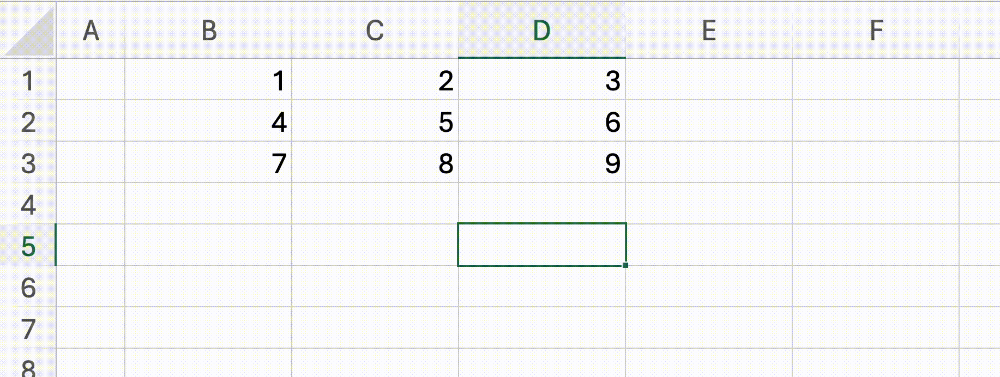</p>

Excel calls this a Spilled Array formula[^excel-dynamic-arrays] [^google-array-formulas]. Implementing this feature in a spreadsheet engine needs a few minor tricks. This is a note on how we built it in [Bean](https://github.com/nilenso/bean).

## The intended behaviour

<p>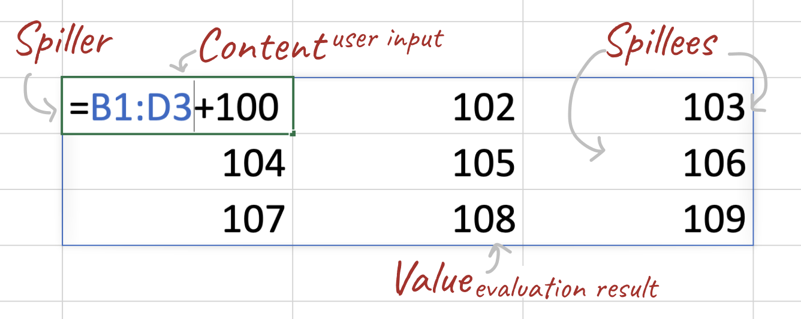</p>

Here's how we want this to work. When a formula evaluates to an array of values
- The values are distributed in cells below. The offset of each spillee is its index in the array.
- Only the first cell (the spiller) has a formula. The spillees' contents remain empty – their value is set by the spiller. This is to avoid overwriting any content a user might have entered manually.
- When a formula tries to spill over a cell that already has some user-entered text, a `Spill Error` is shown.
- When a user input blocking a spillage is cleared, the `Spill Error` is resolved and the array spills.
- When multiple formulas try to spill over a cell, only one of them is allowed to spill. The other ones get a `Spill Error`.
- Usual auto-recalculation still applies: if we edit the spiller, the spillees need to be updated.

I think that covers everything. One last thing – we don't know the size of spillage until the spiller's formula is evaluated. The array can expand or shrink when the spiller's inputs change. Excel calls them "Dynamic arrays" for this reason.

------

If you pay attention to the first two bullets you'll notice it departs significantly from classic spreadsheet calculation. Usually each cell contains a formula and its value is determined by itself: one cell, one formula, one value. We're attempting to sidestep this rule.

What we get in return is the ability to do fancy array programming. A quick search will point you to many [tutorials like this](https://www.youtube.com/watch?v=2USJsIyIzvo) describing its power. Dynamic arrays are a recent addition to Excel but they've become part of standard usage very quickly. They simplify formulas considerably and it's probably the direction spreadsheets are naturally headed in. In a future post I'd like to dig into what makes them so good.

Anyways, back to thinking about programming this stuff.

## Some recalculation basics 

Before we get to spillage, let's see how regular cell references are recalculated. The cell `D5` with the formula `=B1+100`  implies

1. A value dependency – `D5` depends on `B1` for its value.
2. A reval dependency – Every time `B1` is changed, `D5` needs to be re-evaluated.

A cell can refer to any other cell in its formula and there can be many such relations in a spreadsheet. A directional graph captures this well – the nodes are cells and the arrows are dependencies. 

<p>
<div class="img-grid-2x2">
  <div>
  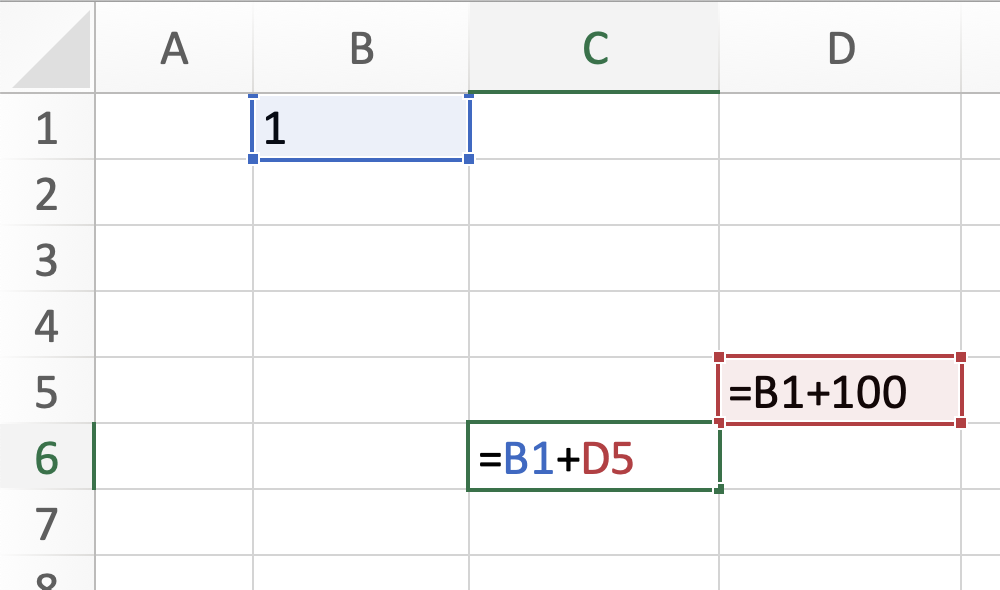
  <br>
  <figcaption style="text-align: center">The formulae</figcaption>
  </div>
  <div>
    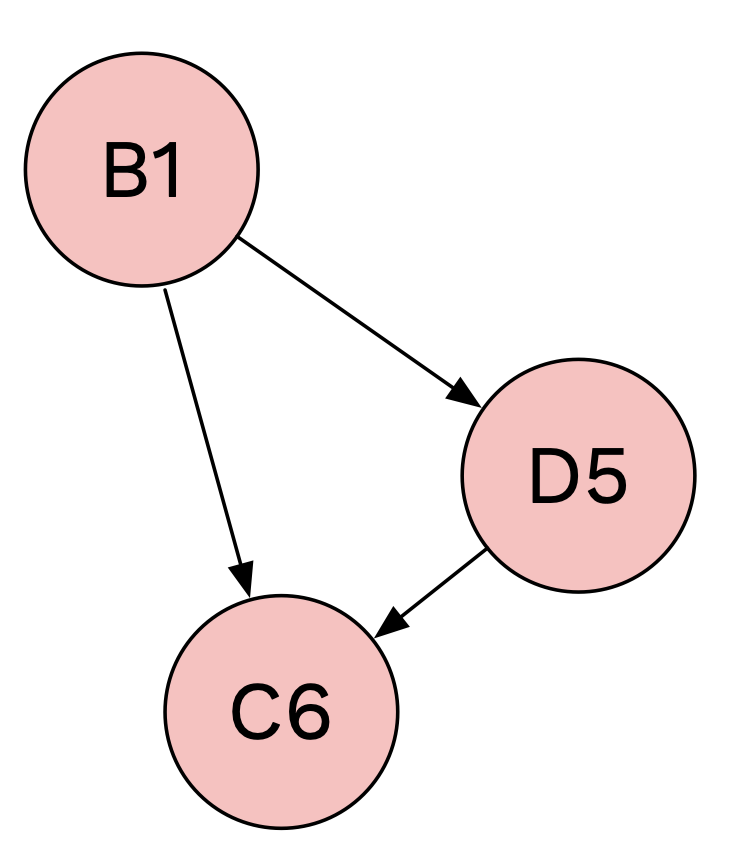
    <br>
    <figcaption style="text-align: center">The depgraph<br>(stores reval dependencies)</figcaption>
  </div>
</div>
</p>

I'll call it a `depgraph`[^sestoft-calls-it-a-support-graph] for short. It's a handy graph to have. Once a cell is updated we simply find its children, evaluate them and repeat this recursively until there's no children left.

<p><div class="card"><figcaption>It <em>seems</em> like a value dependency and reval dependency mean the same. Why do I mention them separately? We will see how spilled cells don't work the same way.</figcaption></div></p>

Given a depgraph and a modified cell, here's a way to recalculate a sheet[^phases] (it's not real code).

```ruby
def eval_sheet(cell, sheet, depgraph):
   new_cell = cell.eval_formula()
   new_sheet = sheet.set_cell(new_cell)   
   new_depgraph = depgraph.remove_edges_to(cell)
   for ref in new_cell.formula.references():
     new_depgraph = depgraph.add_edge(ref, new_cell)

   for dependent in depgraph.get_dependents(cell):
      new_sheet, new_depgraph = eval_sheet(dependent, new_sheet, depgraph)
   end
   
  return new_sheet, new_depgraph
end
```

#### Optimal Recalculation

There are a few ways to make this efficient. An efficient recalculation usually targets
- minimising the set of dependents to be recalculated, and
- making sure each dependent is recalculated at most once.

We'll leave it at that for now (This is covered very well in this [article](https://lord.io/spreadsheets/)).

## What's up with spilled arrays

Let's work on `D6`'s case here: how might it receive `104` when `D5` is evaluated?

<p>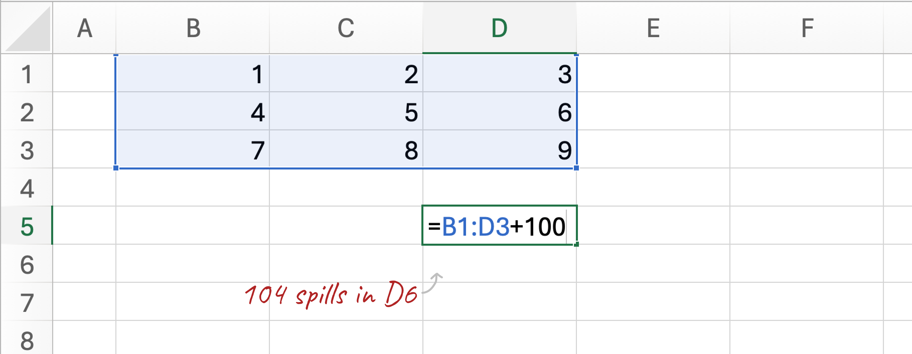</p>

#### Scratching around

First off, the `+` operator needs to apply on matrices (not just single integers) so we can calculate the formula. For now let's assume `+` somehow adds `100` to each element in the matrix and we focus on spilling it down now.

We start by noting that `D6` depends on `D5` for its value i.e `D6` is value dependent on `D5`. We should probably add 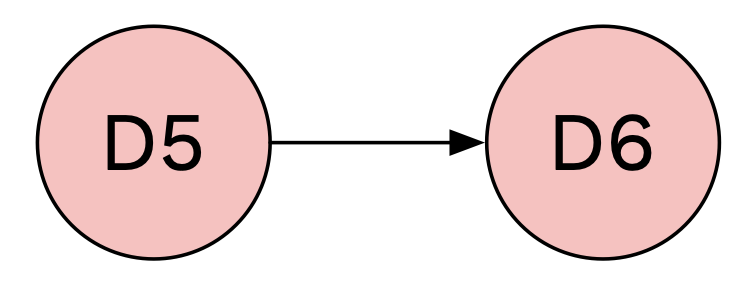 to the depgraph when `D5` is spilled. However `D6` itself is empty and evaluates to nothing. We don't really want to re-evaluate `D6` when `D5` changes. `D6` is **not** reval dependent on `D5`, only value dependent – so we shouldn't add it to the depgraph. We'll need a different way to set values on a cell than its own formula evaluation.

Let's try something else: say `D5` has spilled already and a user adds some content to `D6`. We want to set a spill error at `D5`. This means the spillage (and thereby the spiller) is a reval dependent of `D6`, the spillee. When `D6` is cleared, `D5` spills again.

<p>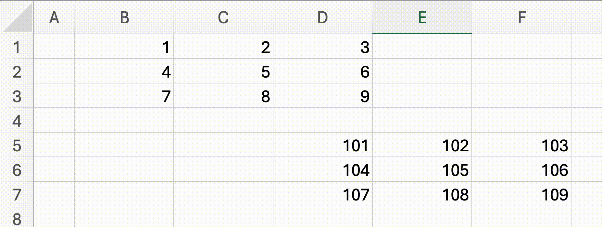</p>

What happens if another cell tries to spill into `D6`? Only one spiller gets to spill at a time. Which one? Excel picks the oldest formula among conflicting spillers so we will do the same.

To summarise
- Spillages don't seem to evaluate in the same top-down manner as regular cell references. There's a two way relationship between spillers and spillees – spillees borrow their value from the spiller but they also control a `Spill error` in the spiller.
- Values can be set independent of the content of the cell.
- In cases of conflict between spills, we keep the oldest evaluated formula.

#### Spillage time

Here's one way to make this work. For each cell, we track two new relations

|                       |                                                                                                                                          |
|-----------------------|------------------------------------------------------------------------------------------------------------------------------------------|
| `spillees`            | A list of cells this cell currently spills into. It's set on the spiller when it successfully spills into other cells.                |
| <div class="td-limited">`interested-spillers`</div>| A list of spiller cells that would like to spill here. |
|                       |                                                                                                                                          |

When a spiller evaluates to an array of values
- Clear existing spillage (if any) of this spiller by going over its `spillees`.
  - Clear out the values set by the spiller.
  - Remove itself from all the spillee's `interested-spillers`.
- Calculate the list of cells that this cell will spill into.
- Add the spiller to each of the cell's `interested-spillers` list.
- If any potential spillee already has a value, put a `Spill Error` in the spiller.
- If all potential spillees are empty, spill: we set the value on spillees directly, while leaving their content blank. We also add the cells to the spiller's `spillees` list.

Whenever a cell is evaluated, we evaluate the `interested-spillers` in addition to other formula dependents. This can be done by adding `interested-spillers` to the depgraph as a reval dependent.

Note that while spilling, if a cell is already spilled into we return a `Spill Error`. This ensures that the oldest formula stays spilled and future spillers don't.

## Detecting circular dependencies

Okay I sneakily left something out earlier to keep things simple. See if you can tell what's wrong with these formulae

<p>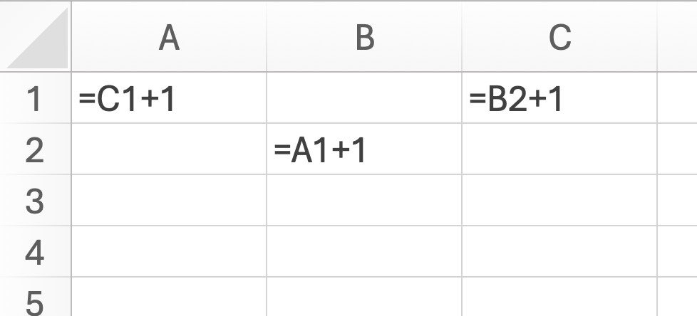</p>

`A1` here depends on `C1`, which depends on `B2`. `B2`, in turn depends on `A1` again for its value. When we evaluate `A1` (or any of the three cells) we'll enter a recalculation loop. Users might create loops like this, deliberately or accidentally. In either case, this is a problem for us and we want to
- Prevent such loops from executing, and
- Warn users if a loop exists.

In this example, we can spot the cycle using the depgraph easily. For single cell references, a circular dependency shows up as a cycle in the depgraph.

<p>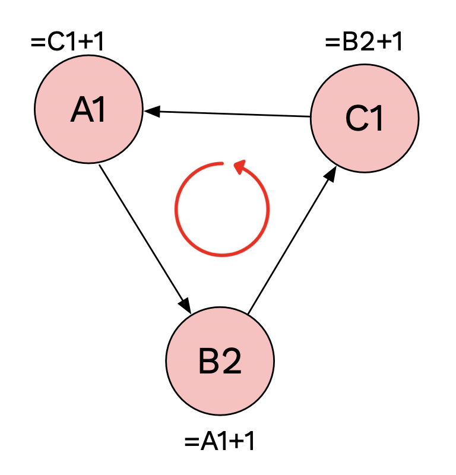</p>

Here's how a cycle can manifest with spilled arrays.

<p>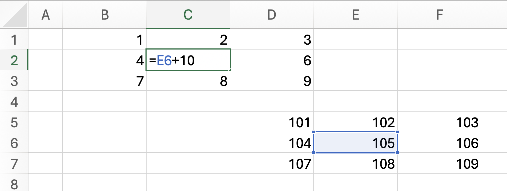</p>

1. `D5` refers to `B1:D3` and spills into `E6`.
2. `E6` gets the value `105` since `C2` is `5`.
3. A formula is entered into `C2` that refers to `E6` (here is the cycle).

Upon evaluating `C2` we'll enter a loop. Here's the depgraph.
<p>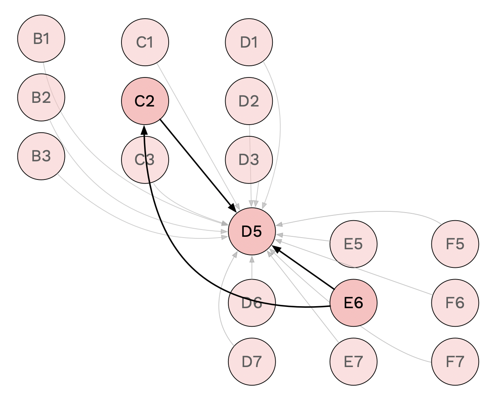</p>

Hang on a second. If you follow the arrows though, there are clearly no cycle in the depgraph. How come?

Let's step back and think about what we've cooked up. Remember that the depgraph captures reval dependencies? Well, when we look for cycles, we're actually looking for cycles in how values are passed along. _Spillers pass down values to spillees._ Let me make a graph that shows value dependencies.

<p>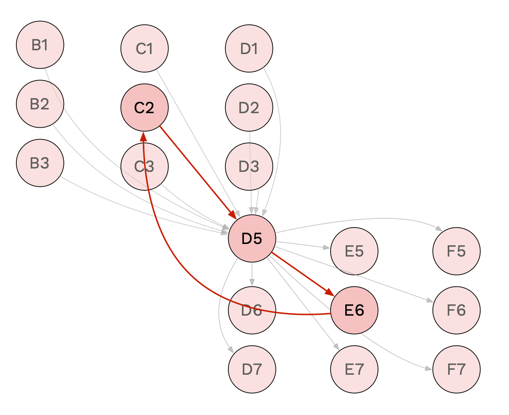</p>

There it is! So we need some way to keep track of value dependencies to detect cycles, in addition to the depgraph. Here's a few options, in decreasing order of naïvety
- We already have the list of `spillees` for each cell. We can traverse the depgraph in combination with this list as we try to find cycles.
- We can make a separate `value-depgraph`.
- We can share the value-depgraph and the reval-depgraph since the nodes are the same, with two "types" of dependencies.


And that's about my best understanding of this problem. I'd be curious to hear better ways to do this. In summary, a nice solution should
- Cover the two-way interaction between spillees and spillers,
- Fit it with the unidirectional reval depgraph, and
- Detect cycles that pass through spilled arrays.

A working implementation of all this can be found [here](https://github.com/nilenso/bean/blob/456dc37ef536a5d2e11e9e89ad540f7e03b9cd7a/src/bean/grid.cljs#L44) (sans detecting circular references).

[^excel-dynamic-arrays]: [Dynamic array formulas and spilled array behavior](https://support.microsoft.com/en-us/office/dynamic-array-formulas-and-spilled-array-behavior-205c6b06-03ba-4151-89a1-87a7eb36e531) – support.microsoft.com 
[^google-array-formulas]: In Google Sheets, you can wrap a formula in an [`ARRAYFORMULA`](https://support.google.com/docs/answer/3093275?hl=en) to achieve the same result. Sheets has had the feature for very long (at least since 2009) while Excel introduced this in 2018.
[^sestoft-calls-it-a-support-graph]: It's called a `Support graph` in [Spreadsheet Implementation Technology](https://direct.mit.edu/books/book/3071/Spreadsheet-Implementation-TechnologyBasics-and) by Peter Sestoft.
[^phases]: We can mark two "phases" in a spreadsheet's evaluation. A first pass, when we start with a sheet full of formula strings and no other information. All the cells in a sheet need to be evaluated in _some_ order (row-major, let's say). The first pass sets up the stage for any incremental re-evaluations. <br><br> Once a first pass is done, each cell update causes an incremental re-evaluation. We tackle incremental re-evaluations here. The first pass can then be expressed as incremental evaluations over each cell starting with a blank sheet.

Once a first pass is done, each cell update causes an incremental re-evaluation. We tackle incremental re-evaluations first. The first pass can be expressed as incremental evaluations over each cell starting with a blank sheet.

<style>
.w-30 {
  width: 30%;
}

.w-40 {
  width: 50%;
}

.w-50 {
  width: 50%;
}

.w-60 {
  width: 60%;
}

.w-80 {
  width: 80%;
}

.img-grid-2x2 {
  display: grid; 
  grid-template-columns: 1fr 1fr;
}

.td-limited {
    width: 200px;
}

@media (max-width:480px)  { 
  .mw-40 {
    width: 40%;
    margin: auto;
  }

  .mw-90 {
    width: 90%;
    margin: auto;
  }

  .mw-95 {
    width: 95%;
    margin: auto;
  }
  
  .img-grid-2x2 {
    display: grid; 
    grid-template-columns: 1fr;
    grid-gap: 30px;
  }

  .td-limited {
    max-width: 120px;
  }
}
</style>
