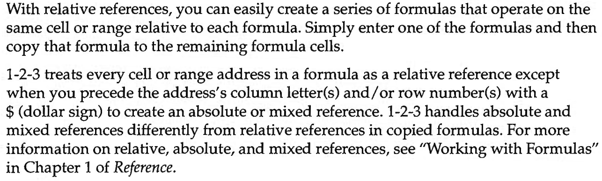

A lot of spreadsheet usage is centered around copying and pasting formulas. Specifically, replicating formulas across a range of data. Here's an example: I have a list of numbers that I want to multiply by five.

I start by entering the formula `= A2 * 5` in the first cell. Then I copy it down until the end of the list.

<p></p>

This function relies on the use of relative cell references. When a relative reference (`A2`) is copied to another cell it adjusts according to the new location. Effectively the reference is an offset and does not refer to a specific cell. An absolute cell reference (`$A$2`) is tied to a specific cell, so when you copy the formula it stays the same.[^microsoft]

Copy-pasting, or "filling down" makes up a big part of spreadsheet magic. Users simply write a formula once and then fill it down. However, copy-pasting leads to duplication and repetitive manual work.
- When a formula is changed, the change needs to be replicated to all the cells it was applied to.
- When new data is added to a list, dependent columns need to be filled into again.

In general, formula replication is known to be error-prone and easy to get wrong.

So we take a look at relative references as a design choice: What problem do they try to solve? What are they good for? Can we do better?

### Some history

Relative references as we know today weren't present in Visicalc, the first commercial spreadsheet. Formula replication also worked a bit differently.

Cell references and the grid primarily served the purpose of a pointing device. Dan Bricklin (inventor of Visicalc) mentions that he started with a free-form canvas but quickly ran into a problem: what names should be used in the formula? A grid and row-column references were his solution to this naming problem.

> My original design was using a mouse and not columns and rows [...] The columns and rows came in later[^boston-linux].

> ... pretty quickly I saw that if you had more than a few values you'd never remember on the screen where things were. Then I said, why not instead of allowing you to put values anywhere, I'll restrict you to a grid? Then when you pointed to a cell, the computer could put the row and column in as a name[^ted-talk].

> `A1` wasn’t really meant to be a name as much as short hand for *that cell*[^implementing-visicalc].

Since references are just a way to point to cells, there are only absolute references. The notion of replicating formulas does exist though: Visicalc comes with a `REPLICATE` function which works basically the same way as a "and fill down".

<p></p>

When a formula is replicated, for each reference Visicalc asks whether it should refer to the entry in the same *relative* position (by typing R) or should not be modified (by typing N). This is quite close to modern cell references, albeit the `REPLICATE` function is responsible for adjusting the references here.

Soon after Microsoft released it's contender to Visicalc called Multiplan, and in it we notice a special notation for relative references for the first time. Multiplan did not have the same kind of referencing. Instead, it had this[^multiplan]:

<p></p>

Instead of using `REPLICATE` to adjust references in formulae (as a procedure), Multiplan added a new kind of reference (a noun). With square brackets denoting the offset, an `RC[-1]` reference did two jobs: pointing to *the cell on the left* and controlling it's behaviour when copied elsewhere. This is now known as `R1C1` notation in Excel[^multiplan-refs].

A couple years later, Mitch Kapor introduced the `$` notation for absolute references in a Lotus 1-2-3 release[^mitch-kapor]. This is also when relative references become the default cell reference notation. From Lotus' user manual [^lotus]:

<p></p>

Lotus-style references became a part of Excel from the get go and they've stuck around since[^excel-2.0-online].

### Why replicate?

Data on a spreadsheet (and in general) is of two kinds

#### Constants
(or scalars) These are single values: an integer, a boolean. References to constants are usually absolute references. When a constant is referred to in a formula being filled-down, users want it to remain unchanged. 

#### Collections
These are a list of values (list of phone numbers) or a list of records (list of employees). When a formula needs to be applied on a collection, users write it first for one item in the collection and then fill it down.

<div style="text-align:center">
<br>
<figcaption>A collection and a constant. Note how the reference to the constant is fixed<br>while a reference to items in the list is the "moving part".</figcaption><br>
</div>

Filling down is a way to apply a formula to a collection. Applying a formula on a collection is a well-understood concept in programming languages: it's called a `map`!

```js
[1, 2, 3, 4, 5].map(element => element * 5); // [5, 10, 15, 20, 25]
```

A fill down points to an implied underlying collection; in the example of multiplying `Numbers` I effectively map on my list of five numbers.

And this is where a fill down shines – it lets a user `map` without defining a collection. Users can indicate that "these cells are a collection" *visually*. Replicating a formula this way has low cognitive overhead. In fact, users may not even pay attention to the presence of a collection actively.

Relative references enable users to do more elaborate list operations as well: A formula can refer to the cell above it, and filling down such a formula produces what's called a `scan`[^scan]. This is commonly done to calculate cumulative totals[^elastic-sdf-example].

However the notion that "these cells are a collection" is captured in the user's mind, not explicitly on the sheet. Formulas are merely duplicated across clusters of cells without any constraints on regularity. As things change over time – new items are added, formulas are tweaked and the sheet exchanges hands – this implicit knowledge of the sheet's structure manifests as errors.

This points us to another, more serious problem. In one of my favourite papers on structuring spreadsheets, Sarkar & Chalhoub[^freedom] have this to say

> Spreadsheet users often operate on higher-level abstractions
(such as arrays and matrices) despite having neither a formal understanding 
of such structures, nor first-class support for such
structures in their spreadsheet application. This mismatch between
the conceptual level at which the user is operating on the data,
and the way in which the spreadsheet tool represents the data, is
a source of errors. A version of this problem, literally called the
‘match-mismatch conjecture’, was observed by visual languages
researchers in the early 1990s.

Essentially, we need the ability to represent collections on the sheet concretely. How can I specify that I want to multiply the list of `Numbers` by 5, where the list itself can shrink/expand/move around? Can I specify there's *a list* in the first place? Can I lookup in a range of data *as a lookup table*? Then there's the bigger question: How do we do it in a way that's still spreadsheet-like: it has low cognitive overhead, it's visual and doesn't mess too much with the grid.

### No more relative references?
Despite the manual effort, the duplication and the errors, relative references are simple and enable users to express operations on collections that would be otherwise tedious (and complex) to write. Let's summarise our design goals for a hypothetical improvement over relative references:
- We want to express array operations – `map`, `filter`, `reduce` etc. to begin with.
- We want to avoid duplication – a formula can be written once and applied to all items in the collection.
- We want to accomodate growth – formulae shouldn't need an update when new items are added to a collection.
- The abstraction should be easy to buy into. It should have low cognitive overhead and it should work well with the grid.

Being able to move away from relative references should depend on how well these constraints can be met. In the same paper, Sarkar & Chalhoub also look at other attempted solutions.

> There have been several commercial and research attempts
to address this mismatch. The approach is to introduce data structures 
that aim to strike a balance between the freedom and flexibility of the traditional grid, and the
safety and power of formal types and structures. Each of these
solutions imposes some restrictions on the freedom of the grid,
as well as increases the complexity of the formula language to
introduce operations that apply at the level of the structure, a
necessary cost of higher abstraction. None of these proposals has
seen commercial success in any way comparable to the success
of the free grid.

Well, that's not very encouraging. In a follow up post, we'll look at some of these solutions and try a few things of our own. 


[^replicate]: [Here's a short demo](https://youtu.be/wU8WhGtRWF8?feature=shared&t=126) of `REPLICATE` in action.

[^microsoft]: [Switch between relative, absolute, and mixed references](https://support.microsoft.com/en-gb/office/switch-between-relative-absolute-and-mixed-references-dfec08cd-ae65-4f56-839e-5f0d8d0baca9) – support.microsoft.com

[^multiplan]:[Page 136, Microsoft Multiplan User Manual](https://vt100.net/dec/aa-p230a-tv_multiplan_reference.pdf) (1982)

[^multiplan-refs]: Multiplan did not have A1-style referencing. It had R1C1 references only.

[^lotus]: [Page 1-31, Lotus 1-2-3 Release 3.1 Tutorial](https://ia601706.us.archive.org/25/items/lotus-1-2-3-release-3.1-reference/Lotus%201-2-3%20Release%203.1%20-%20Tutorial.pdf). This is from the earliest user manual I could find, it was probably present in an earlier version.

[^mitch-kapor]: Mentioned in the [interview to Boston Linux](https://www.youtube.com/watch?v=hcjwRFT_uto&t=1495s) (2023)

[^boston-linux]: [Dan Bricklin and Bob Frankston's interview to Boston Linux](https://www.youtube.com/live/hcjwRFT_uto?si=pgDFPPCY0bqjj4bs&t=3390) (2023)

[^excel-2.0-online]: You can try out Excel's earliest release for Windows online on [pcjs.org](https://www.pcjs.org/software/pcx86/app/microsoft/excel/2.0/)!

[^ted-talk]: [Meet the inventor of the electronic spreadsheet: Dan Bricklin](https://youtu.be/YDvbDiJZpy0?feature=shared&t=395) (2017)

[^implementing-visicalc]: [Implementing Visicalc](https://rmf.vc/ImplementingVisiCalc) (2003)

[^elastic-sdf-example]: Simon Peyton Jones shows an example of a pretty convoluted scan operation made possible using relative references in his talk on [Elastic sheet-defined functions](https://youtu.be/jH2Je6wUvPs?feature=shared&t=765) (2020)

[^scan]: [scanl - hackage.haskell.org](https://hackage.haskell.org/package/base-4.19.1.0/docs/Prelude.html#v:scanl)

[^freedom]: [It’s Freedom to Put Things Where My Mind Wants”: Understanding and Improving the User Experience of Structuring Data in Spreadsheets](https://advait.org/files/chalhoub_2022_data_structuring.pdf), Advait Sarkar, George Chalhoub (2022)
<style>
.w-30 {
  width: 30%;
}

.w-40 {
  width: 50%;
}

.w-50 {
  width: 50%;
}

.w-60 {
  width: 60%;
}

.w-70 {
  width: 70%;
}

.w-80 {
  width: 80%;
}

.w-90 {
  width: 90%;
}

.img-grid-2x2 {
  display: grid; 
  grid-template-columns: 1fr 1fr;
}

.td-limited {
    width: 200px;
}

@media (max-width:480px)  { 
  .mw-40 {
    width: 40%;
    margin: auto;
  }

  .mw-90 {
    width: 90%;
    margin: auto;
  }

  .mw-95 {
    width: 95%;
    margin: auto;
  }
  
  .img-grid-2x2 {
    display: grid; 
    grid-template-columns: 1fr;
    grid-gap: 30px;
  }

  .td-limited {
    max-width: 120px;
  }
}
</style>
