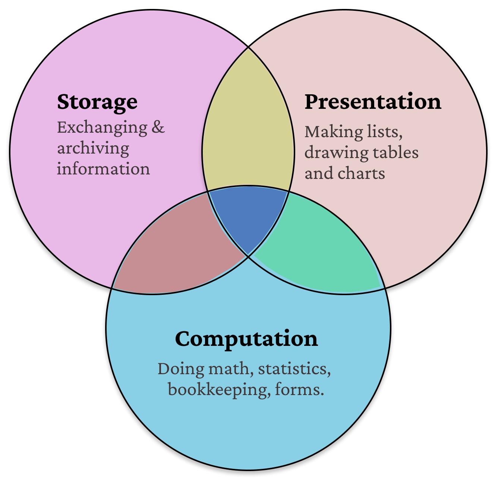
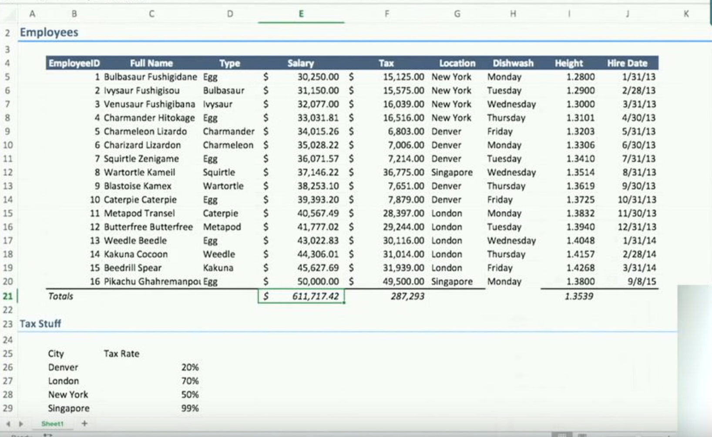
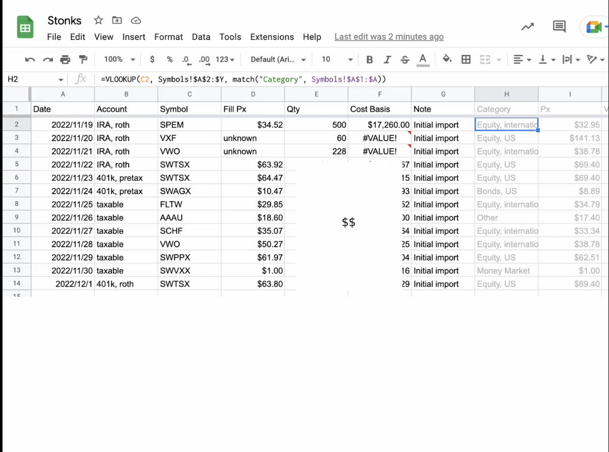
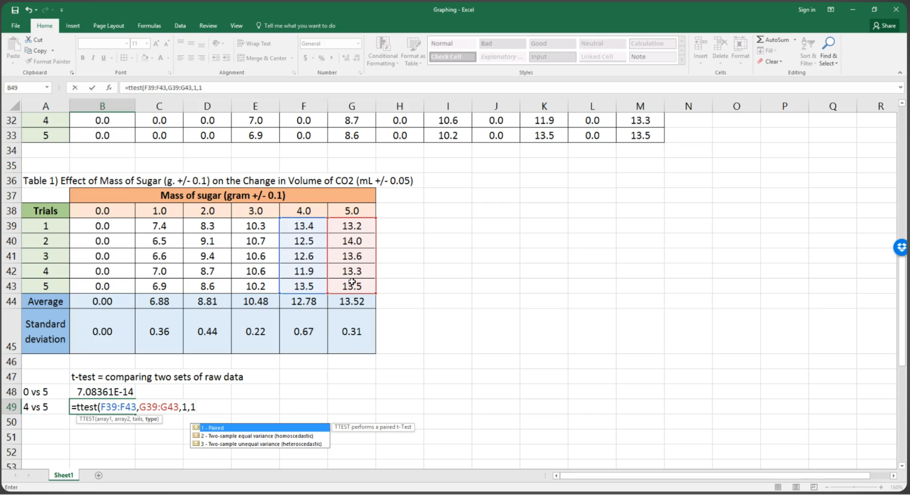
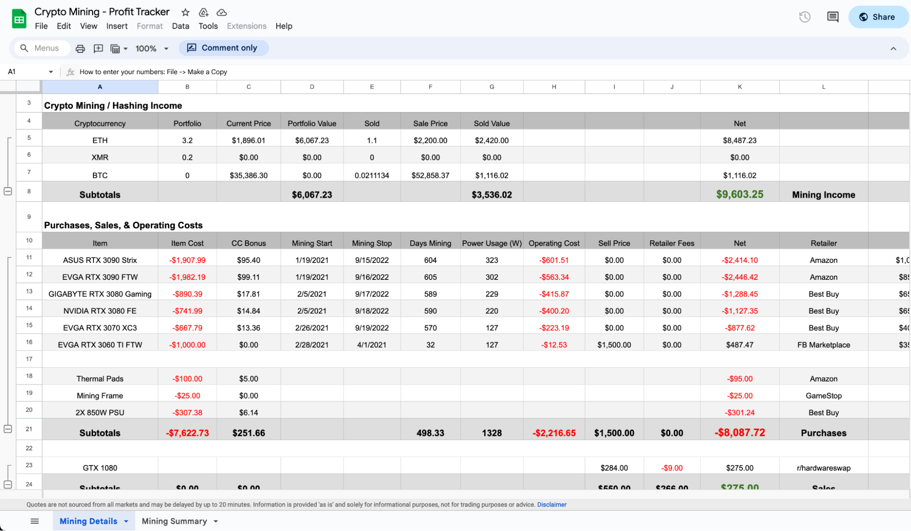

*or why we need more spreadsheets.*

My father decided to get a whole bunch of new furniture made (like we all do at some point in our lives). New beds, doors, chairs, closets. A carpenter was hired. Many kinds of woods were looked at and some were picked. I was tasked with tracking finances for the whole exercise. 

I dropped into a Google Sheet and got started. By the end I had half a dozen worksheets, a few pivot tables and a variety of formulas. The work finished over a couple of weeks. We paid out the carpenter from the calculations in the sheet.

As a software engineer, I like to write and appreciate <em>good</em> software (no, I pine for it) – easy to work with, easy to understand, amenable to change, and reliable. The sheet was none of these things. 

I was compelled to take a close look at why it was so. This is a quick summary of things I've found, some of my thoughts and what I’ve been up to with them.

## My Spreadsheet problem
If you’ve spent enough time on a sheet you’ve seen these: copy-paste errors, finicky date formats, a mixup with a relative/absolute reference, some rows at the bottom missing from an average[^spreadsheet-programming-problems], awkward VLOOKUPs, INDEX-MATCHes, workarounds for circular references[^dont-circular-ref] and mega-formulas[^mega-formulas]. Put a few of these in a sheet and it gets messy very quickly.

I ran into some of the same problems
- I made a master list of furniture items and some summaries out of it (total cost of labor, cost by furniture type etc). Each time I added new items to the list, I had to update all the dependent formulas[^solution-was-entire-sheet].
- The cost of each item depended on the kind of wood used. I listed the wood prices on one side but they weren't easy to look up across the sheet[^solution-was-vlookup].
- The carpenter charged per furniture so his pay depended on the master list. He wanted to verify my math, and justifiably so. Who was to say I hadn’t missed a few numbers here and there? The verification process meant walking backwards from the final total, one hop at a time. The trail of numbers, so to say, was hard to trace.

I see similar problems when programming, except there's usually a way to solve them there.

## Small Software

Spreadsheet usage falls in any intersection of Storage, Presentation and Computation needs.

People don't always do all three. Spreadsheets are predominantly used for storage and presentation only – to make lists and lay out tables (todo lists, project management trackers, etc). Most of them don’t contain any formulas[^how-trello-is-different]. However for the (small group of) users whose work falls in the computation circle they’re uniquely powerful. I wouldn’t plan this work anywhere else. Nothing else fits. Nardi & Miller[^spreadsheet-eup] ascribe this to
- Computational techniques that match users' tasks and shield them from the low-level details of traditional programming, and
- A table-oriented interface that serves as a model for users' applications.

Here are some sheets similar to mine. A small company's book of employees & salaries [^sample1], a personal stock portfolio [^sample2], a scientist organising some statistics [^sample3], a crypto mining profit tracker [^sample4].

These sheets are like regular programs in many ways. Felienne Hermans, a veteran spreadsheet researcher, puts it very simply: Spreadsheets are code[^spreadsheets-are-code]. She also goes on to show that they suffer from the same problems as real software.

 ❖ 

Simplistically, information systems are a place to put some information, do transformations on it (optionally) and look it up later[^information-systems]. A cash register, a cab booking app, a payment gateway, a search engine are all information systems in that sense. These sheets particularly are small information systems. I want to call them <em>small software</em>. The ask is dependable, good quality programs except their size – in surface area and complexity – is <em>small</em>.

Other names have been used synonymously (personal software, organizational software, end-user programs) but to me small captures the vibe well[^convival-software]. I also use small to distinguish from <em>big</em> software
1. Small implies it’s quick to make and get up and running.
2. It’s maintained by a small number of people, usually just one person.
3. While big software can employ a wide variety of powerful tools to build, small software cannot. The tools for building small things need to be simple, few and effective.

## Spreadsheets in 2023

  
  

    <blockquote style="margin-bottom: 0;color: black">We wanted tools to make sheds, we got tools to make skyscrapers.
     
     
    –– a tweet I cannot find anymore
    </blockquote>
  

If we posit that spreadsheets are small software, how do they fare on the qualities we’re looking for? Consider the following
- Spreadsheet software is fully backward compatible to prevent breakage in old sheets, to the extent that newer ones preserve bugs from older ones[^excel-leap-year-bug]. Change is <em>accretive</em> and almost no features have been discarded in the last couple of decades[^finance-industry]. Every spreadsheet needs to be compatible with MS Excel and carries its baggage.
- There's little support for structured programming concepts to maintain and debug a sheet. While there's been some new additions (tables, named functions) they don't fit as well.
- As a symptom, errors in spreadsheets are commonplace and a big problem. There’s an <a href="https://eusprig.org/">interest group</a> that tackles problems in this area and <a href="https://www.perfectxl.com/">many</a> <a href="https://www.i-nth.com/">consulting</a> <a href="https://incisive.com/solutions-for-microsoft-excel/">firms</a> that teach how to make good spreadsheets. Spreadsheet errors can cause damage very much like real software. They’re not as well understood which makes them more unfortunate.

Over the years, developers have arrived at some must-haves to build good software. We like to use good languages, write tests, peer review our code etc. Very little of this has made its way to spreadsheets so it’s not surprising they’re
- Easy to spike in but hard to maintain and audit.
- Riddled with errors, universally.
- Hard to build robust processes around. 
- Harder to use than they should be.

## In closing

One, I think the spreadsheet medium is nascent, by the measure of how much has and hasn’t been tried out. There are many bad primitives and very few guardrails. We don’t get a new spreadsheet every year. We do this with programming languages all the time. 

<a href="https://rows.com/">New spreadsheets</a> or <a href="https://www.airtable.com/">spin-offs</a> that try to solve these problems usually depart from the recipe in some significant way. <a href="https://sdg.csail.mit.edu/projects/espalier">Experimental ones</a> and <a href="https://datarabbit.com/">dataflow</a> <a href="https://joshuahhh.com/projects/pane/">programming</a> have their own place but they are all <em>something</em> <em>different</em>. And it’s not reasonable to expect mainstream spreadsheets to solve this.

Secondly, I think patching your favorite programming language on top does not work well. Each language has its abstractions and ways of working, which may be at odds with the spreadsheet paradigm. Translating between paradigms has a real cost that a user has to bear. Users also realize that there are too many languages to deal with already and more of them is a problem[^python-in-excel].

Thirdly, I think more people should be implementing their own spreadsheets. These things are probably not showing up in popular ones anytime soon
- A simple and expressive formula language that supports its contexts of use.
- Useful data structures that provide organization but don’t get in the way[^structuring-data-in-spreadsheets].
- Functions as a tool for problem solving, not just a place to tuck away gnarly formulas.
- Tools to deal with change – Tests and Version control.
- Good interop with other languages.

So we’re <a href="https://github.com/nilenso/bean">writing a spreadsheet</a> to try out some of these ideas. It's intended to be a playground to implement things explored in theory and run experiments. <em>Maybe eventually</em>, it'll become a full-fledged piece of software that I wouldn't mind using. The plan is to write about the proceedings as we go.

Lastly, any other way of writing sane and functional programs requires a big commitment to learn and get started. The choice is between the scrappy utilities in existing spreadsheets and installing Python on your computer. I think spreadsheets still hold the promise of a well-formed environment for making small software; where the medium, the language, and the tooling works as one.

--- 
Thanks to <a href="https://twitter.com/AtharvaRaykar">Atharva</a>, <a href="https://twitter.com/prathyvsh/">Prathyush</a> and friends for reviewing this post.

## Footnotes, references

[^spreadsheet-programming-problems]: [Spreadsheet programming problems](https://leancrew.com/all-this/2013/04/spreadsheet-programming-problems) – leancrew.com (Blog, 2013)
[^dont-circular-ref]: [WHY and HOW to stop using circular references to calculate interest](https://www.youtube.com/watch?v=k5rG_MvIWWs") – Diarmuid Early (Video, 2022)
[^mega-formulas]: [Megaformula Examples"](https://flylib.com/books/en/3.427.1.132/1/) – flylib.com (Blog)
[^information-systems]: [Information system](https://www.britannica.com/topic/information-system) – britannica.com (Article)
[^how-trello-is-different]: [How Trello is different](https://www.joelonsoftware.com/2012/01/06/how-trello-is-different/) – Joel Spolsky (Blog, 2012)
[^spreadsheet-eup]: [The spreadsheet interface: A basis for end-user programming ](https://www.miramontes.com/writing/spreadsheet-eup/) – Bonnie A. Nardi, James R. Miller (Paper, 1990)
[^finance-industry]: There’s something to be said about how the rise of the finance industry has shaped the evolution of spreadsheet software. I’ll not say much but leave [this bit from a show](https://www.youtube.com/watch?v=toSRmKKiosQ&t=2650s) I thoroughly enjoyed watching.
[^sample1]: Example from [You Suck at Excel with Joel Spolsky](https://www.youtube.com/watch?v=0nbkaYsR94c) (Video, 2015)
[^sample2]: Example from [A Relational Spreadsheet](https://kevinlynagh.com/financial-plan/) (Blog, 2020)
[^sample3]: Example from [Data processing in Excel for IB Biology](https://www.youtube.com/watch?v=yfQ1mQMTpn0) (Video, 2016)
[^sample4]: Example from [a spreadsheet](https://www.reddit.com/r/gpumining/comments/mu695x/gpu_mining_profitability_spreadsheet/) from reddit.
[^spreadsheets-are-code]: [Pure Functional Programming in Excel • Felienne Hermans • GOTO 2016](https://www.youtube.com/watch?v=0yKf8TrLUOw) (Video, 2016)
[^python-in-excel]: [Python in Excel Review: The Good, The Bad, & The Ugly! Chandoo](https://youtu.be/whzmtv9qfIQ?feature=shared&t=719) (Video, 2023)
[^structuring-data-in-spreadsheets]: [It’s Freedom to Put Things Where My Mind Wants](https://advait.org/files/chalhoub_2022_data_structuring.pdf) – advait.org (Paper, 2022)
[^excel-leap-year-bug]: [Excel incorrectly assumes that the year 1900 is a leap year](https://learn.microsoft.com/en-us/office/troubleshoot/excel/wrongly-assumes-1900-is-leap-year) – learn.microsoft.com (Article)
[^solution-was-entire-sheet]: I solved this by referring to all rows till the bottom of the sheet in formulas.
[^solution-was-vlookup]: The solution here was a VLOOKUP or an INDEX-MATCH formula.
[^convival-software]: Prathyush tells me this sounds similar to [Convival computing]("https://akkartik.name/post/convivial-computing")

